# 基于Springboot的阿博图书馆管理系统

## Springboot-0032


## 技术栈

Springboot mybatisplus vue mysql maven


## 数据库表(13张)


## 功能介绍

```properties
管理员：首页、个人中心、用户管理、图书分类管理、图书信息管理、图书借阅管理、图书归还管理、缴纳罚金管理、留言板管理、系统管理，

用户：首页、个人中心、图书借阅管理、图书归还管理、缴纳罚金管理、我的收藏管理，前台首页；首页、图书信息、公告信息、留言反馈、个人中心、后台管理等功能。
```


## 图片

### 前台


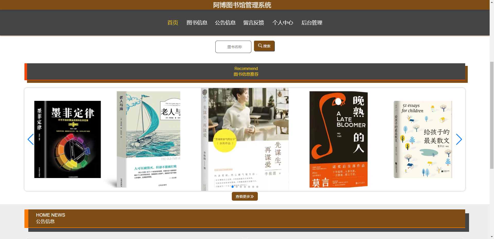


### 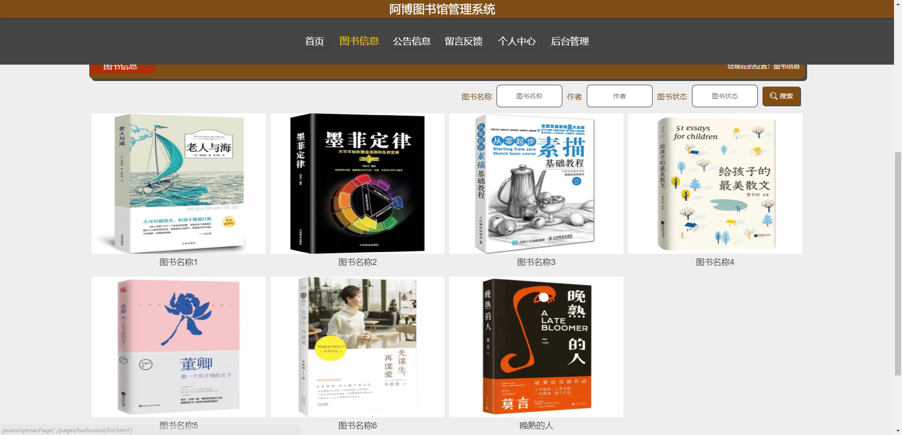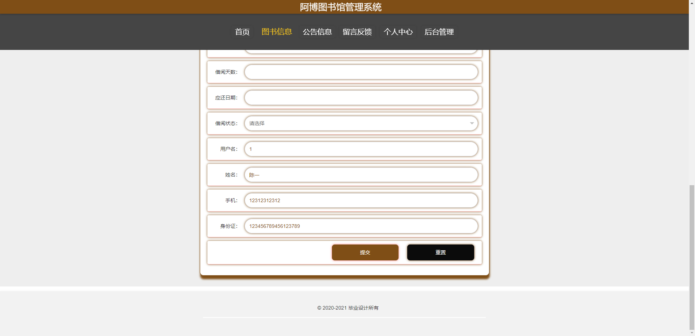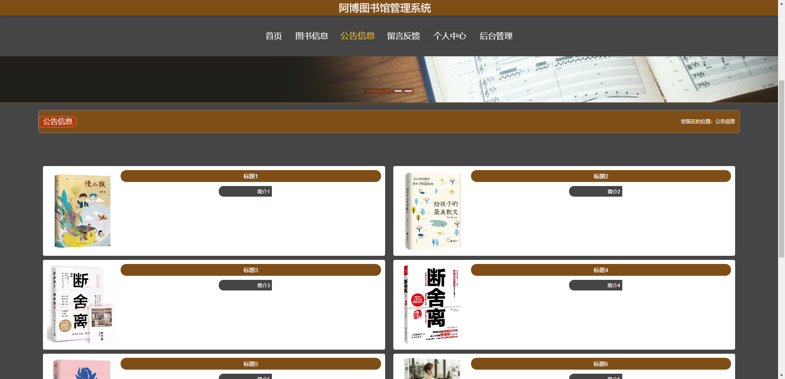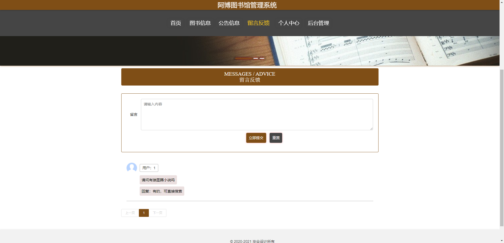

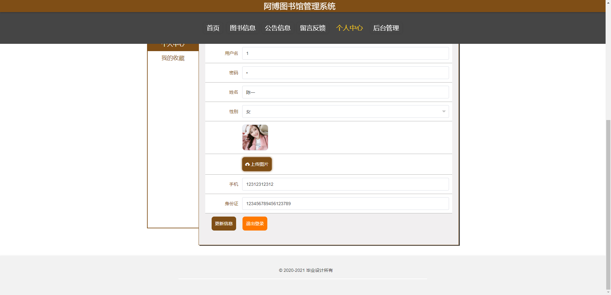

### 后台


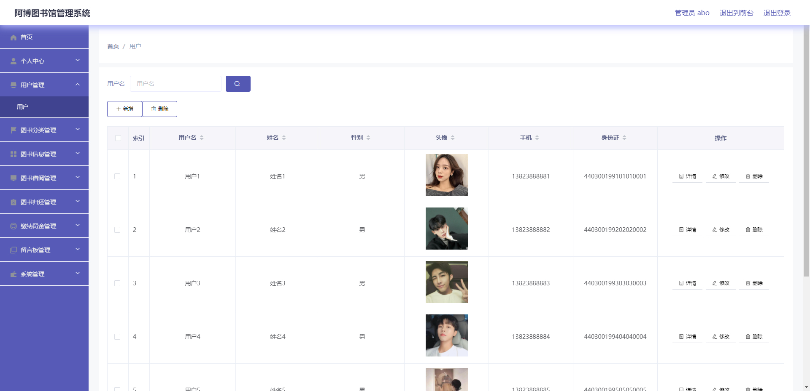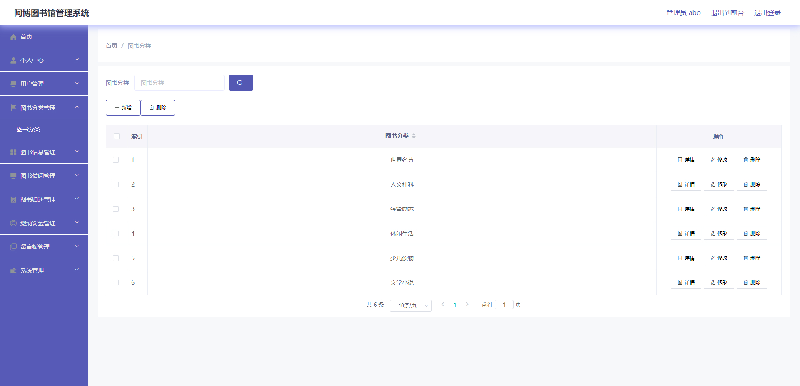

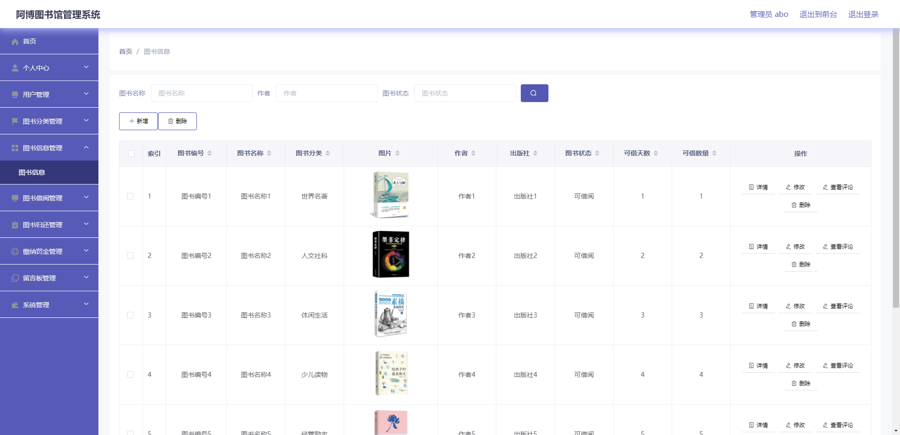


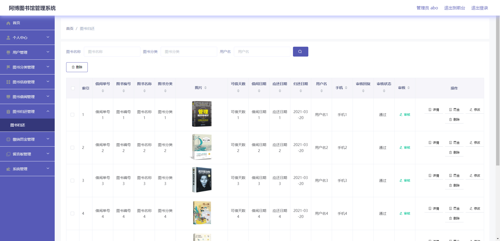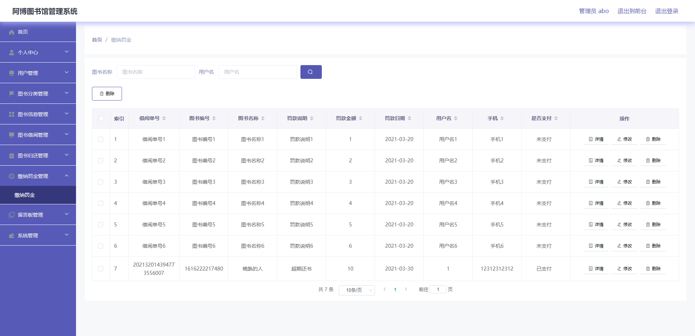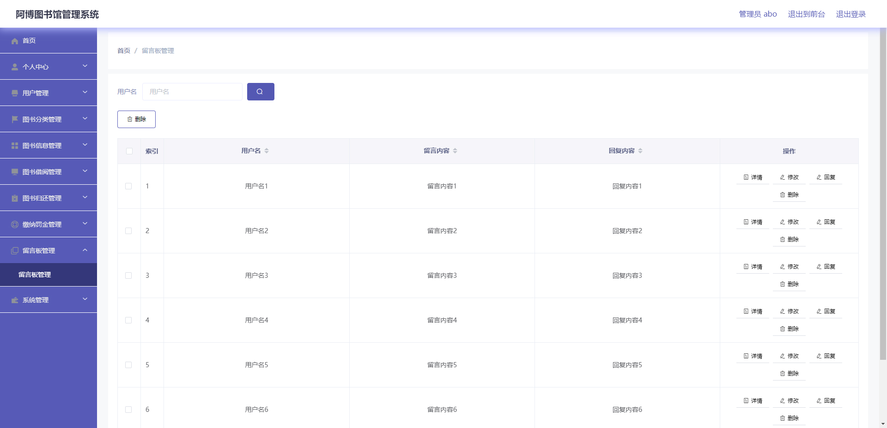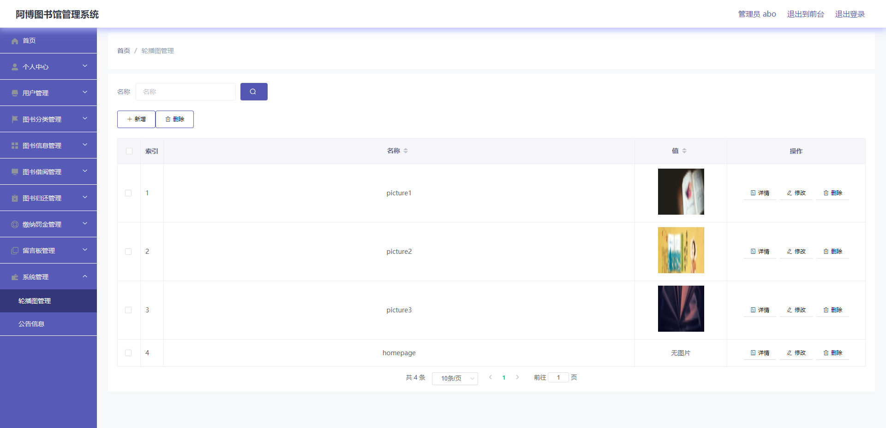


## 访问路径

### 前台

```properties
http://localhost:8080/springboot33dng/front/pages/login/login.html

账号 1
密码 1
```

### 后台

```properties
http://localhost:8080/springboot33dng/admin/dist/index.html#/login

账号 abo
密码 abo
```


## 功能图

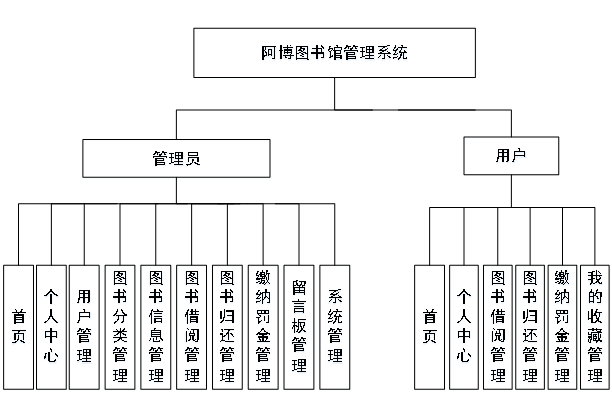


## 文档目录

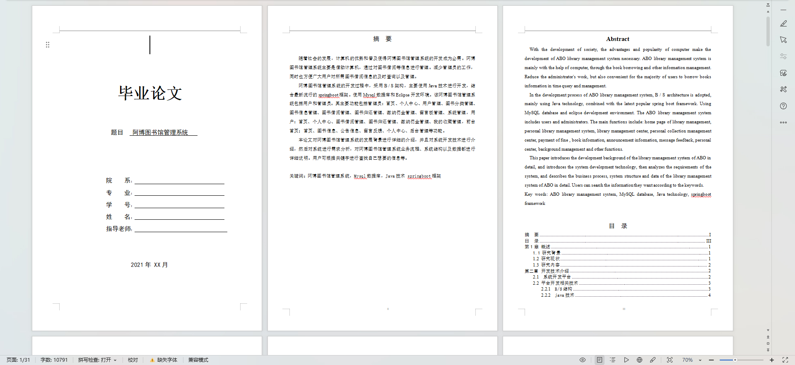


## 打赏或交流


